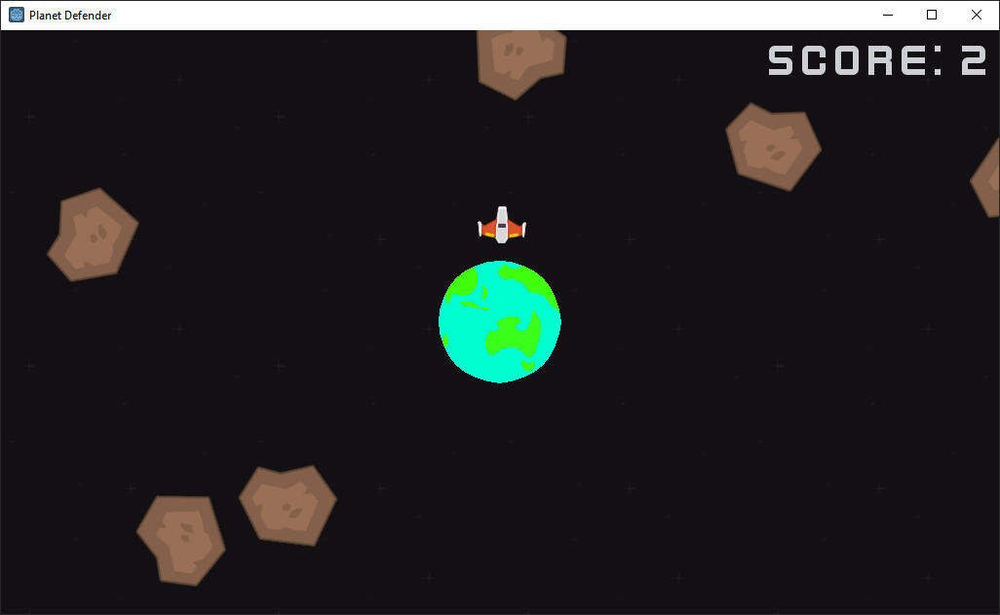

# Planet Defender

A cross-platform, free and open source game made with [Godot Engine](https://godotengine.org).

## Story

The planet you live on is under a meteor attack. The people of this planet elect you to defend the planet. So you hop into your spaceship and you try to shoot down the meteors.

## Todo

- [ ] Make a better planet

- [ ] Add player lives (subtract one when player hit by meteor)

- [ ] Make all assets from scratch (?)

- [ ] Add a pause menu

- [ ] Add credits and highscores menu

- [ ] Make goals/achievements

- [ ] Add unlocking new spaceships

- [ ] Create an icon and logo

## Contributing

Pull requests are welcome. For a feature request or bug, please open an issue on GitLab.

## Licence

Planet Defender is released under the GNU General Public License v3.

## Credits

At this time, Planet Defender mostly uses assets provided by [Kenny](https://kenny.nl).
